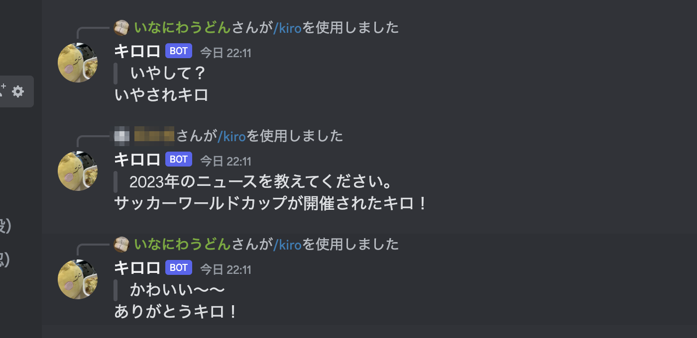

# kiroro-bot

キロロくんとおしゃべりする Discord Bot です。  
Cloudflare Workers 上で作動します。



## おしゃべりするには

サーバーに招待し、スラッシュコマンド `/kiro <おしゃべりの内容>` で呼び出します。

```
/kiro キロロはお酒飲む？
キロロはお酒は飲めないキロ。

/kiro キロロ6連射
キロロ
キロロ
キロロ
キロロ
キロロ
キロロ
```

## Development

### コマンドの登録

```
npm install
ts-node src/register.ts
```

### ローカル環境で動かす

[Discord App](https://discord.com/developers/docs/intro)、[OpenAI API](https://openai.com/blog/openai-api) にそれぞれ登録し、API キーを取得します。  
また `.dev.vars` に環境変数を記述した上で、以下のコマンドを実行します。

```
DISCORD_APPLICATION_ID = "<DISCORD_APPLICATION_ID>"
DISCORD_PUBLIC_KEY = "<DISCORD_PUBLIC_KEY>"
DISCORD_TOKEN = "<DISCORD_TOKEN>"
OPEN_API_KEY = "<OPEN_API_KEY>"
```

```
npm install
npm run dev
```

### Cloudflare Workers へのデプロイ

`以下のコマンドを実行します。

```bash
npm i
wrangler secret put DISCORD_APPLICATION_ID
wrangler secret put DISCORD_PUBLIC_KEY
wrangler secret put DISCORD_TOKEN
wrangler secret put OPEN_API_KEY
npm run deploy
```
